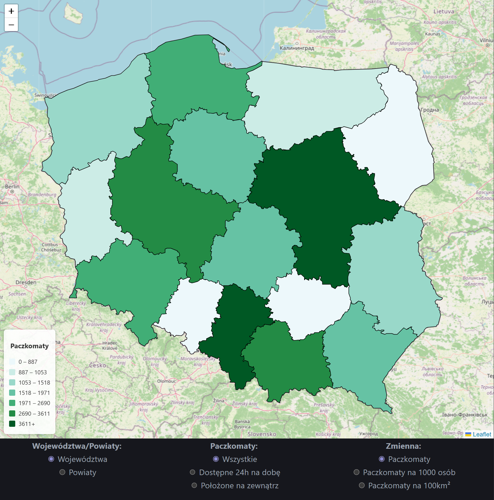
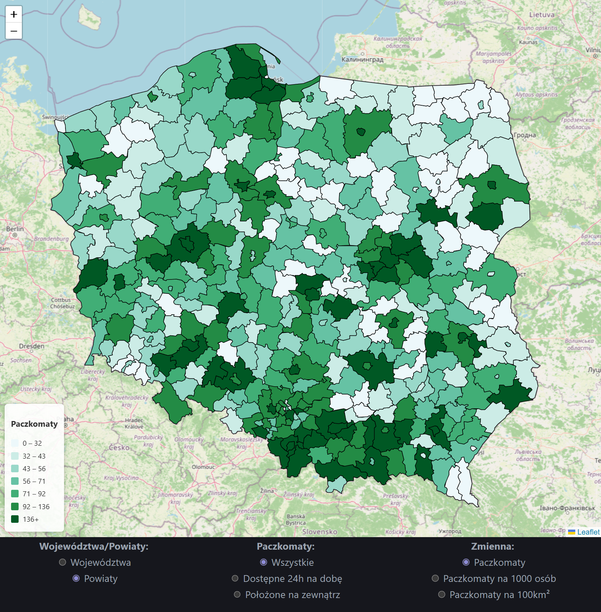
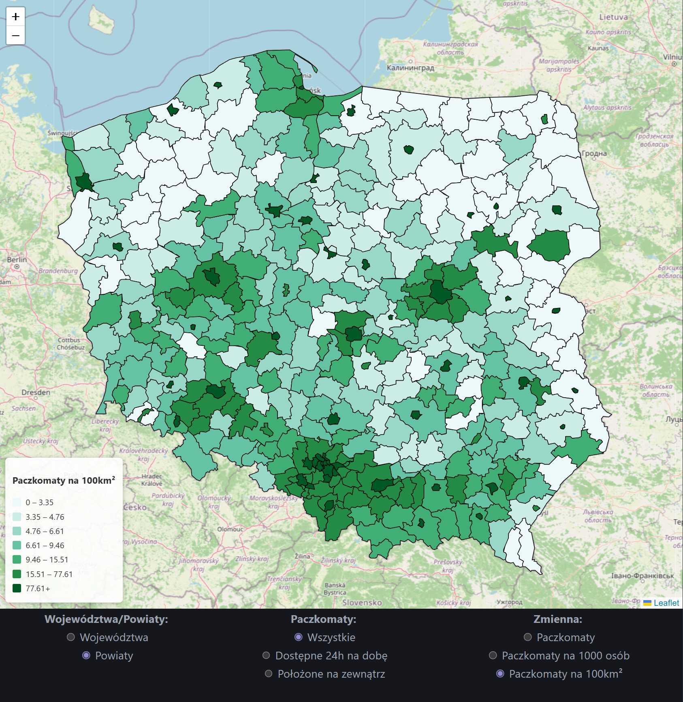
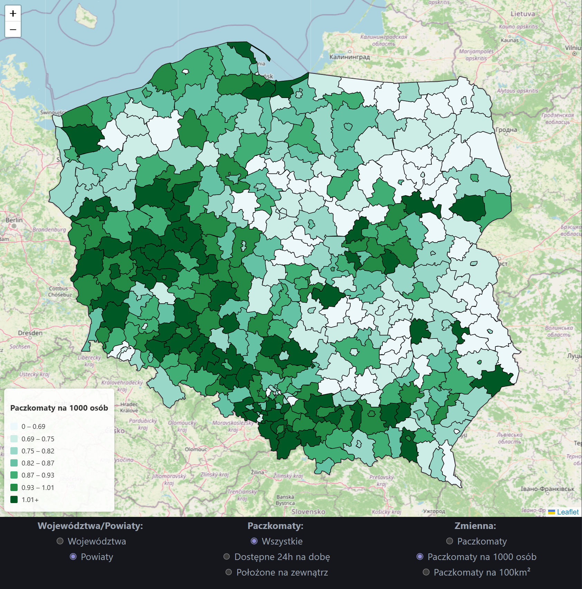

# Mapa Paczkomatów Inpost

## Author

- **Name:** Jakub Haraszkiewicz
- **Email:** jak.haraszkiewicz@gmail.com

## Overview
Stworzono interaktywną wizualizację ilości Paczkomatów w poszczególnych województwach i powiatach w Polsce. Pozwala zaobserwować jaki dostęp do Paczkomatów jest w poszczególnych regionach, gdzie są gęsto rozmieszczone, gdzie przypada ich mniej lub więcej na mieszkańca, co może pomóc w decyzji o rozmieszczeniu nowych paczkomatów.
 
## Demo & Description

Rozwiązanie agreguje dane z podanego API według województw i powiatów, funkcje agregujące znajdują się w oddzielnych plikach [FetchWojData.ts](./src/FetchWojData.ts) i [FetchPowData.ts](./src/FetchPowData.ts).  

Agregacja według województw wykorzystuje pole address_details.province: Paczkomaty są zliczane dla każdego województwa, a wyniki zapisywane są jako obiekt w pliku [wojdata.json](./src/wojdata.json) wraz z informacjami o ludności i powierzchni. Ludność i powierzchnia dla województw pochodzą z pliku [woj.json](./src/woj.json), są to wartości orientacyjne, docelowo powinny być zastąpione danymi z zewnętrznego API.  

API z informacjami o Paczkomatach nie posiada informacji o powiecie, dlatego agregacja według powiatów wykorzystuje położenie geograficzne Paczkomatów i dane z pliku geojson. Dla każdego powiatu sprawdzane jest, czy dany Paczkomat leży w jego obrębie, jeśli tak, Paczkomat jest doliczany do tego powiatu. Wynikowy obiekt zapisany jest w pliku [powdata.json](./src/powdata.json), natomiast informacje o ludności i powierzchni pochodzą z pliku [PowData.csv](./src/PowData.csv), w którym znajdują się dane z [Banku Danych Lokalnych GUS-u](https://bdl.stat.gov.pl/bdl/dane/podgrup/temat) (stan na rok 2023).  

Sama wizualizacja zrealizowana jest jako aplikacja React. Główny komponent aplikacji to mapa z biblioteki Leaflet. Na mapę naniesione są granice powiatów lub województw z plików geojson, obszary są kolorowane według wartości wizualizowanej zmiennej. Wartości dzielone są na siedem przedziałów o równej liczebności.  

Biblioteka react-leaflet nie posiada wbudowanego komponentu legendy, dlatego jest on stworzony ręcznie znacznikami html: dla każdego przedziału liczbowego wyświetlany div zawierający kwadrat z kolorem oraz napis z zakresem.  

Pod mapą wyświetlane jest w formie tabeli małe menu do sterowania wizualizacją. Można w nim wybrać podział na województwa lub powiaty, cechę Paczkomatów (wszystkie, dostępne 24/7, położone na zewnątrz), wyświetlaną zmienną (liczba, liczba na 1000 mieszkańców, liczba na 100 km²). Każda z tych opcji jest kontrolowana przez stan react, który określa które pola obiektów z danymi są czytane i jaki geojson jest pobierany.









## Technologies

React, TypeScript, Vite, Leaflet (React-Leaflet), Turf.js, Node.js (preprocesing), ESLint

## How to run

### Prerequisites
- Node.js: v24
- npm: v11
- TypeScript: v6.0.3
- Vite: v8.0.10
- React: v19.2.5
- Leaflet / React-Leaflet
- Turf.js
- Środowisko: nowoczesna przeglądarka (Chrome/Firefox)

### Build & run

```bash
git clone https://github.com/serunio/inpost
cd inpost
npm i
npm run dev
```

## What I would do with more time

Plany rozszerzenia funkcjonalności projektu:
- Rozszerzenie o kraje inne niż Polska
- Filtrowanie po dostępnych metodach płatności
- Rozróżnienie na Paczkomaty i Paczkopunkty
- Dodanie widoku mapy z poziomu gminy
- Dodanie kontekstu województwa / powiatu / gminy, aby ułatwić przegląd na konkretnym obszarze

Należałoby też zaimplementować pobieranie danych o województwach i powiatach z API np. TERYT, aby były aktualne, wiarygodne i niewybrakowane (obecnie np. brak informacji o powiecie jeleniogórskim).  
Wizualizacja w obecnej formie nie przewiduje występowania dwóch obszarów o jednakowej nazwie, a sytuacja taka występuje, jest to coś, co należy poprawić.  
Dane o liczbie Paczkomatów są skośne, co można uwzględnić, dobierając przedziały wartości.

## AI usage

Przy tworzeniu projektu użyto narzędzia ChatGPT w charakterze konsultanta:
- Zasugerowało użycie bibliotek leaflet oraz turf
- Wygenerowało przekształcenie nazw powiatów za pomocą wyrażeń regularnych
- Zasugerowało metodę dodania legendy
- Zapewniło drobne poprawki i usprawnienia
- Wygenerowało orientacyjne dane o województwach (mock)
